

<!-- 打字机动画标题 -->

<!-- 个人简介徽章 -->

 

<!-- 社交链接 -->

---

##  关于我

   天津科技大学 · 独立游戏开发者 &amp; 模组作者 
   主攻 C# / C++ / Lua · Unity 游戏开发 
   Survivalcraft 生态 · 工业模组 · 配方系统 
   也在折腾 WinForms / Blender / 数字逻辑

> *Learning C++++* — 持续探索系统底层与游戏机制的实现方式。

---

##  GitHub 数据

<!-- 统计卡片：跟随 GitHub 浅色 / 深色主题 -->
<table align="center" width="100%">
  <tr>
    <td valign="top" width="50%" align="center">
      <picture>
        <source media="(prefers-color-scheme: dark)" srcset="https://raw.githubusercontent.com/CS-LX/CS-LX/main/profile/stats.svg">
        <source media="(prefers-color-scheme: light)" srcset="https://raw.githubusercontent.com/CS-LX/CS-LX/main/profile/stats-light.svg">
        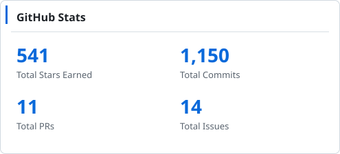
      </picture>
    </td>
    <td valign="top" width="50%" align="center">
      <picture>
        <source media="(prefers-color-scheme: dark)" srcset="https://raw.githubusercontent.com/CS-LX/CS-LX/main/profile/streak.svg">
        <source media="(prefers-color-scheme: light)" srcset="https://raw.githubusercontent.com/CS-LX/CS-LX/main/profile/streak-light.svg">
        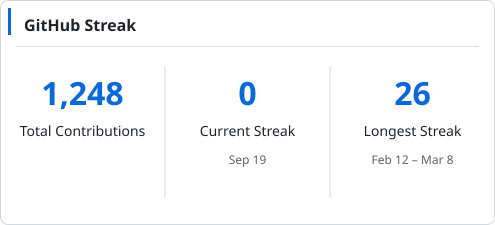
      </picture>
    </td>
  </tr>
</table>

  <picture>
    <source media="(prefers-color-scheme: dark)" srcset="https://raw.githubusercontent.com/CS-LX/CS-LX/main/profile/languages.svg">
    <source media="(prefers-color-scheme: light)" srcset="https://raw.githubusercontent.com/CS-LX/CS-LX/main/profile/languages-light.svg">
    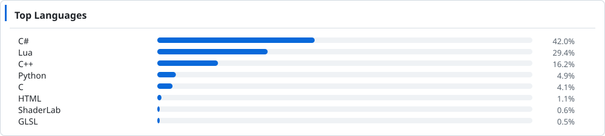
  </picture>

  <picture>
    <source media="(prefers-color-scheme: dark)" srcset="https://raw.githubusercontent.com/CS-LX/CS-LX/main/profile/trophies.svg">
    <source media="(prefers-color-scheme: light)" srcset="https://raw.githubusercontent.com/CS-LX/CS-LX/main/profile/trophies-light.svg">
    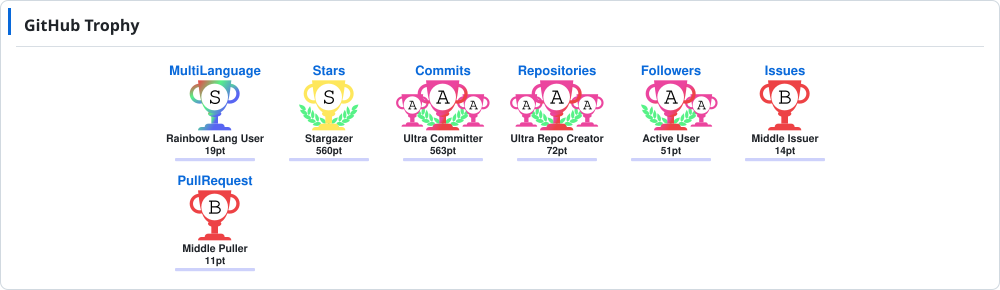
  </picture>

<!-- 贡献活动图 -->

  <picture>
    <source media="(prefers-color-scheme: dark)" srcset="https://raw.githubusercontent.com/CS-LX/CS-LX/main/profile/activity.svg">
    <source media="(prefers-color-scheme: light)" srcset="https://raw.githubusercontent.com/CS-LX/CS-LX/main/profile/activity-light.svg">
    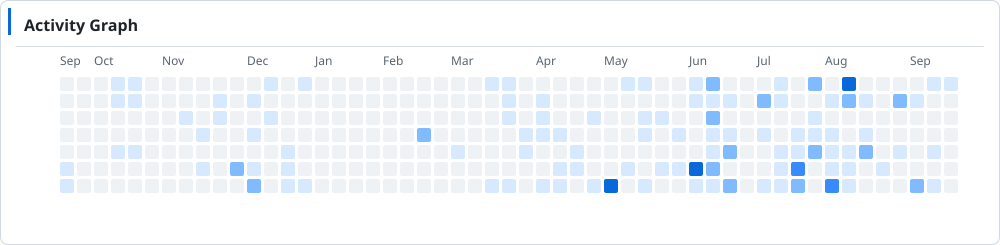
  </picture>

---

##  精选项目

<!-- featured-projects:start -->
<table align="center" width="100%">
  <tr>
    <td width="50%" align="center">
      <a href="https://github.com/CS-LX/CPURacer">
        <picture>
          <source media="(prefers-color-scheme: dark)" srcset="https://raw.githubusercontent.com/CS-LX/CS-LX/main/profile/projects/CPURacer.svg">
          <source media="(prefers-color-scheme: light)" srcset="https://raw.githubusercontent.com/CS-LX/CS-LX/main/profile/projects/CPURacer-light.svg">
          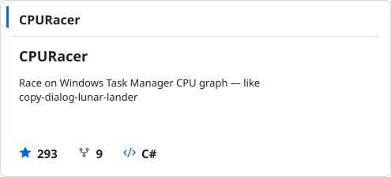
        </picture>
      </a>
    </td>
    <td width="50%" align="center">
      <a href="https://github.com/CS-LX/PowerfulWindSlickedBackHair_Winform">
        <picture>
          <source media="(prefers-color-scheme: dark)" srcset="https://raw.githubusercontent.com/CS-LX/CS-LX/main/profile/projects/PowerfulWindSlickedBackHair_Winform.svg">
          <source media="(prefers-color-scheme: light)" srcset="https://raw.githubusercontent.com/CS-LX/CS-LX/main/profile/projects/PowerfulWindSlickedBackHair_Winform-light.svg">
          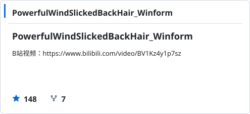
        </picture>
      </a>
    </td>
  </tr>
  <tr>
    <td width="50%" align="center">
      <a href="https://github.com/CS-LX/RickAstley.exe-RinRorm.exe-">
        <picture>
          <source media="(prefers-color-scheme: dark)" srcset="https://raw.githubusercontent.com/CS-LX/CS-LX/main/profile/projects/RickAstley.exe-RinRorm.exe-.svg">
          <source media="(prefers-color-scheme: light)" srcset="https://raw.githubusercontent.com/CS-LX/CS-LX/main/profile/projects/RickAstley.exe-RinRorm.exe--light.svg">
          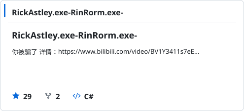
        </picture>
      </a>
    </td>
    <td width="50%" align="center">
      <a href="https://github.com/CS-LX/Inhuman">
        <picture>
          <source media="(prefers-color-scheme: dark)" srcset="https://raw.githubusercontent.com/CS-LX/CS-LX/main/profile/projects/Inhuman.svg">
          <source media="(prefers-color-scheme: light)" srcset="https://raw.githubusercontent.com/CS-LX/CS-LX/main/profile/projects/Inhuman-light.svg">
          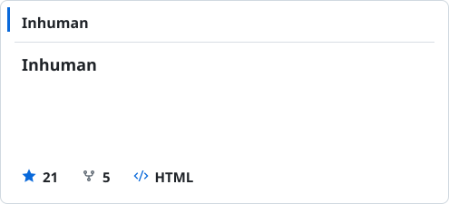
        </picture>
      </a>
    </td>
  </tr>
</table>
<!-- featured-projects:end -->

---

##  已发布游戏

<!-- games:start -->
<table width="100%">
  <tr>
    <td>
      <a href="./profile/games/flower-desktop.svg#gh-dark-mode-only">
        <picture>
          <source media="(max-width: 520px)" srcset="https://raw.githubusercontent.com/CS-LX/CS-LX/main/profile/games/flower-mobile.svg">
          <source media="(max-width: 900px)" srcset="https://raw.githubusercontent.com/CS-LX/CS-LX/main/profile/games/flower-tablet.svg">
          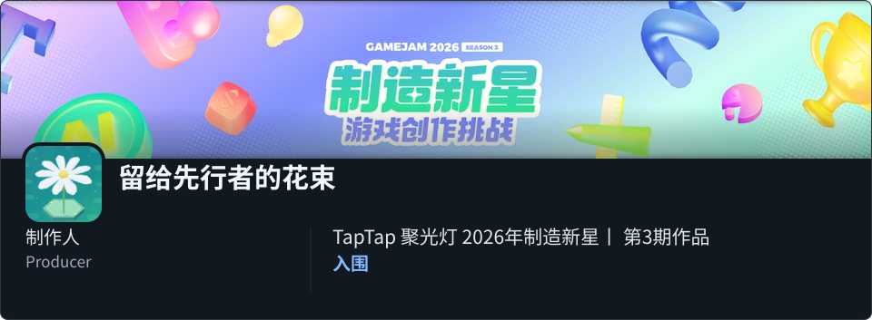
        </picture>
      </a>
      <a href="./profile/games/flower-desktop-light.svg#gh-light-mode-only">
        <picture>
          <source media="(max-width: 520px)" srcset="https://raw.githubusercontent.com/CS-LX/CS-LX/main/profile/games/flower-mobile-light.svg">
          <source media="(max-width: 900px)" srcset="https://raw.githubusercontent.com/CS-LX/CS-LX/main/profile/games/flower-tablet-light.svg">
          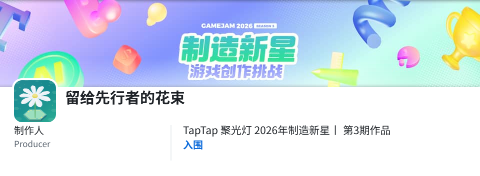
        </picture>
      </a>
      
<a href="https://www.taptap.cn/app/911154">TapTap</a> &nbsp;·&nbsp; <a href="https://www.taptap.cn/game-jam/risingstar03">赛事页面</a> &nbsp;·&nbsp; <a href="https://www.taptap.cn/moment/849346918747210573">具体参见</a>

    </td>
  </tr>
</table>

<table width="100%">
  <tr>
    <td>
      <a href="./profile/games/superanchor-desktop.svg#gh-dark-mode-only">
        <picture>
          <source media="(max-width: 520px)" srcset="https://raw.githubusercontent.com/CS-LX/CS-LX/main/profile/games/superanchor-mobile.svg">
          <source media="(max-width: 900px)" srcset="https://raw.githubusercontent.com/CS-LX/CS-LX/main/profile/games/superanchor-tablet.svg">
          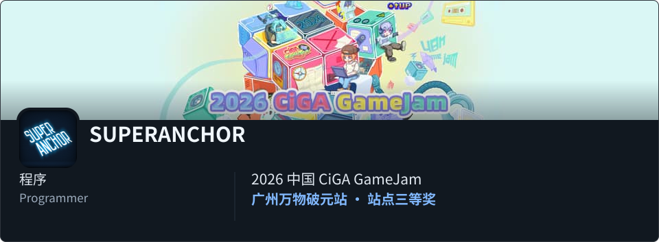
        </picture>
      </a>
      <a href="./profile/games/superanchor-desktop-light.svg#gh-light-mode-only">
        <picture>
          <source media="(max-width: 520px)" srcset="https://raw.githubusercontent.com/CS-LX/CS-LX/main/profile/games/superanchor-mobile-light.svg">
          <source media="(max-width: 900px)" srcset="https://raw.githubusercontent.com/CS-LX/CS-LX/main/profile/games/superanchor-tablet-light.svg">
          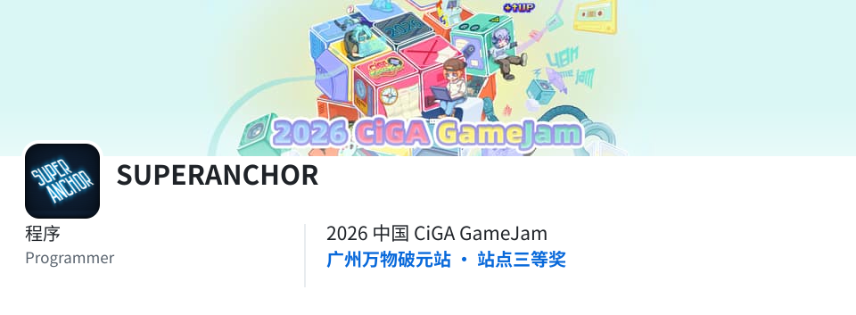
        </picture>
      </a>
      
<a href="https://store.steampowered.com/app/4934990/SUPERANCHOR">Steam</a>

    </td>
  </tr>
</table>

<table width="100%">
  <tr>
    <td>
      <a href="./profile/games/stencilmask-desktop.svg#gh-dark-mode-only">
        <picture>
          <source media="(max-width: 520px)" srcset="https://raw.githubusercontent.com/CS-LX/CS-LX/main/profile/games/stencilmask-mobile.svg">
          <source media="(max-width: 900px)" srcset="https://raw.githubusercontent.com/CS-LX/CS-LX/main/profile/games/stencilmask-tablet.svg">
          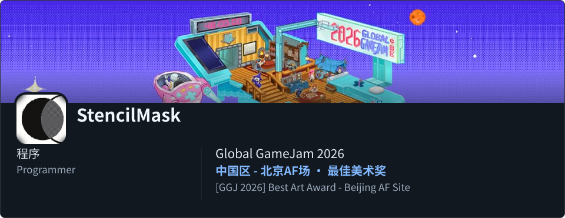
        </picture>
      </a>
      <a href="./profile/games/stencilmask-desktop-light.svg#gh-light-mode-only">
        <picture>
          <source media="(max-width: 520px)" srcset="https://raw.githubusercontent.com/CS-LX/CS-LX/main/profile/games/stencilmask-mobile-light.svg">
          <source media="(max-width: 900px)" srcset="https://raw.githubusercontent.com/CS-LX/CS-LX/main/profile/games/stencilmask-tablet-light.svg">
          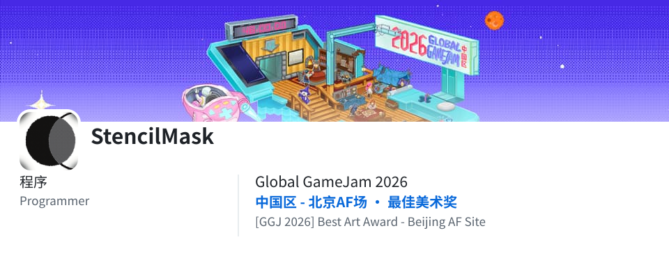
        </picture>
      </a>
      
<a href="https://www.taptap.cn/app/814328">TapTap</a>

    </td>
  </tr>
</table>

<table width="100%">
  <tr>
    <td>
      <a href="./profile/games/null-kitchen-desktop.svg#gh-dark-mode-only">
        <picture>
          <source media="(max-width: 520px)" srcset="https://raw.githubusercontent.com/CS-LX/CS-LX/main/profile/games/null-kitchen-mobile.svg">
          <source media="(max-width: 900px)" srcset="https://raw.githubusercontent.com/CS-LX/CS-LX/main/profile/games/null-kitchen-tablet.svg">
          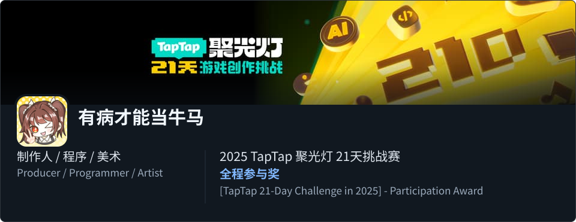
        </picture>
      </a>
      <a href="./profile/games/null-kitchen-desktop-light.svg#gh-light-mode-only">
        <picture>
          <source media="(max-width: 520px)" srcset="https://raw.githubusercontent.com/CS-LX/CS-LX/main/profile/games/null-kitchen-mobile-light.svg">
          <source media="(max-width: 900px)" srcset="https://raw.githubusercontent.com/CS-LX/CS-LX/main/profile/games/null-kitchen-tablet-light.svg">
          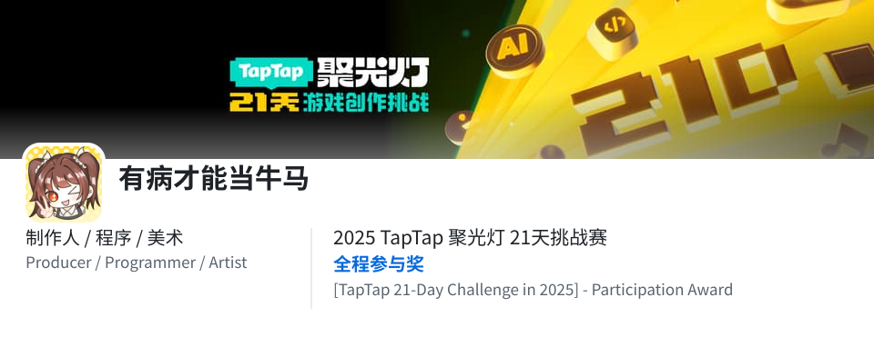
        </picture>
      </a>
      
<a href="https://www.taptap.cn/app/779871">TapTap</a> &nbsp;·&nbsp; <a href="https://store.steampowered.com/app/4143170">Steam</a>

    </td>
  </tr>
</table>

<table width="100%">
  <tr>
    <td>
      <a href="./profile/games/darkrune-desktop.svg#gh-dark-mode-only">
        <picture>
          <source media="(max-width: 520px)" srcset="https://raw.githubusercontent.com/CS-LX/CS-LX/main/profile/games/darkrune-mobile.svg">
          <source media="(max-width: 900px)" srcset="https://raw.githubusercontent.com/CS-LX/CS-LX/main/profile/games/darkrune-tablet.svg">
          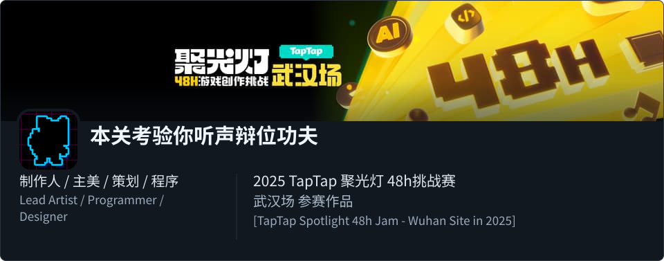
        </picture>
      </a>
      <a href="./profile/games/darkrune-desktop-light.svg#gh-light-mode-only">
        <picture>
          <source media="(max-width: 520px)" srcset="https://raw.githubusercontent.com/CS-LX/CS-LX/main/profile/games/darkrune-mobile-light.svg">
          <source media="(max-width: 900px)" srcset="https://raw.githubusercontent.com/CS-LX/CS-LX/main/profile/games/darkrune-tablet-light.svg">
          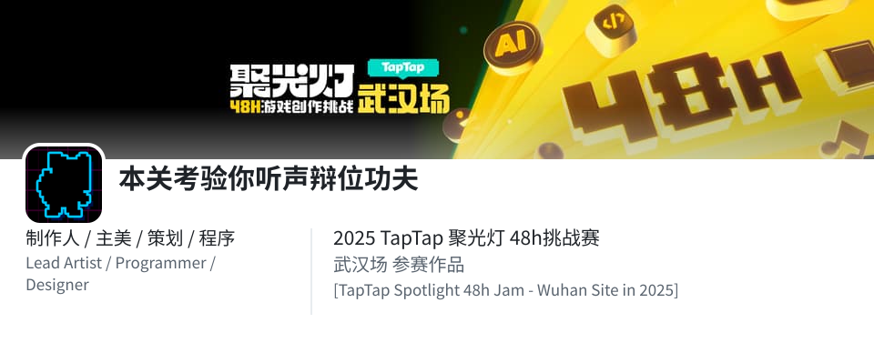
        </picture>
      </a>
      
<a href="https://www.taptap.cn/app/789796">TapTap</a>

    </td>
  </tr>
</table>

<table width="100%">
  <tr>
    <td>
      <a href="./profile/games/new-folder-desktop.svg#gh-dark-mode-only">
        <picture>
          <source media="(max-width: 520px)" srcset="https://raw.githubusercontent.com/CS-LX/CS-LX/main/profile/games/new-folder-mobile.svg">
          <source media="(max-width: 900px)" srcset="https://raw.githubusercontent.com/CS-LX/CS-LX/main/profile/games/new-folder-tablet.svg">
          
        </picture>
      </a>
      <a href="./profile/games/new-folder-desktop-light.svg#gh-light-mode-only">
        <picture>
          <source media="(max-width: 520px)" srcset="https://raw.githubusercontent.com/CS-LX/CS-LX/main/profile/games/new-folder-mobile-light.svg">
          <source media="(max-width: 900px)" srcset="https://raw.githubusercontent.com/CS-LX/CS-LX/main/profile/games/new-folder-tablet-light.svg">
          
        </picture>
      </a>
      
<a href="https://www.taptap.cn/app/800774">TapTap</a>

    </td>
  </tr>
</table>

<table width="100%">
  <tr>
    <td>
      <a href="./profile/games/shadown-desktop.svg#gh-dark-mode-only">
        <picture>
          <source media="(max-width: 520px)" srcset="https://raw.githubusercontent.com/CS-LX/CS-LX/main/profile/games/shadown-mobile.svg">
          <source media="(max-width: 900px)" srcset="https://raw.githubusercontent.com/CS-LX/CS-LX/main/profile/games/shadown-tablet.svg">
          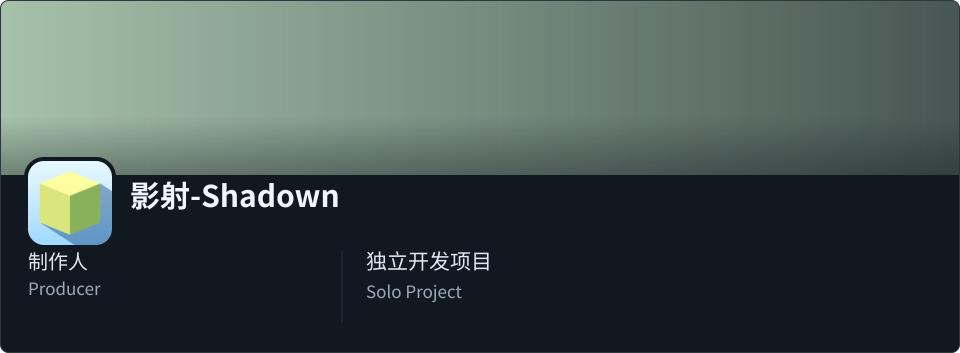
        </picture>
      </a>
      <a href="./profile/games/shadown-desktop-light.svg#gh-light-mode-only">
        <picture>
          <source media="(max-width: 520px)" srcset="https://raw.githubusercontent.com/CS-LX/CS-LX/main/profile/games/shadown-mobile-light.svg">
          <source media="(max-width: 900px)" srcset="https://raw.githubusercontent.com/CS-LX/CS-LX/main/profile/games/shadown-tablet-light.svg">
          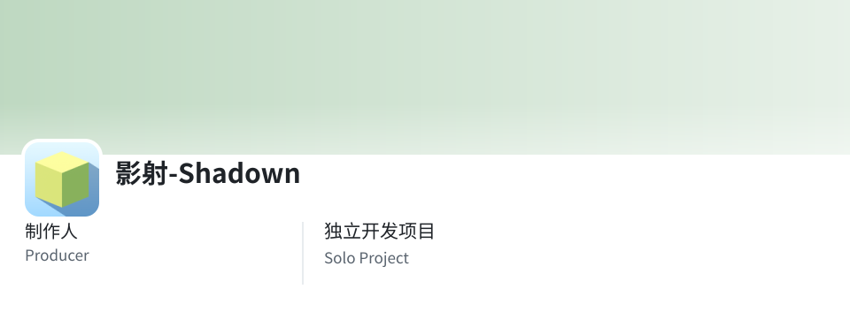
        </picture>
      </a>
      
<a href="https://www.taptap.cn/app/793993">TapTap</a> &nbsp;·&nbsp; <a href="https://store.steampowered.com/app/4499100/">Steam</a>

    </td>
  </tr>
</table>

<!-- games:end -->

---

##  技术栈

**语言**

<picture>
  <source media="(prefers-color-scheme: dark)" srcset="https://skillicons.dev/icons?i=cs,cpp,c,python,lua&theme=dark&perline=8">
  <source media="(prefers-color-scheme: light)" srcset="https://skillicons.dev/icons?i=cs,cpp,c,python,lua&theme=light&perline=8">
  
</picture>

**工具 & 平台**

<picture>
  <source media="(prefers-color-scheme: dark)" srcset="https://skillicons.dev/icons?i=unity,git,github,blender,visualstudio,rider,stackoverflow,figma,ps,sentry&theme=dark&perline=8">
  <source media="(prefers-color-scheme: light)" srcset="https://skillicons.dev/icons?i=unity,git,github,blender,visualstudio,rider,stackoverflow,figma,ps,sentry&theme=light&perline=8">
  
</picture>

---

##  贡献贪吃蛇

<!-- 需要 Actions 工作流生成 snake 动画，见 .github/workflows/snake.yml -->

  <picture>
    <source media="(prefers-color-scheme: dark)" srcset="https://raw.githubusercontent.com/CS-LX/CS-LX/output/github-contribution-grid-snake-dark.svg">
    <source media="(prefers-color-scheme: light)" srcset="https://raw.githubusercontent.com/CS-LX/CS-LX/output/github-contribution-grid-snake.svg">
    
  </picture>

---

Built with  using
 
<a href="https://docs.github.com/en/rest">GitHub REST API</a> ·
<a href="https://docs.github.com/en/graphql">GitHub GraphQL API</a> ·
<a href="https://github.com/ryo-ma/github-profile-trophy">profile-trophy</a> ·
<a href="https://github.com/tandpfun/skill-icons">skill-icons</a> ·
<a href="https://remixicon.com/">Remix Icon</a> ·
<a href="https://github.com/Platane/snk">snk</a>

  
<picture>
  <source media="(prefers-color-scheme: dark)" srcset="https://capsule-render.vercel.app/api?type=waving&color=0:0d1117,100:1f6feb&height=100&section=footer&text=Thanks%20for%20visiting!&fontSize=24&fontColor=c9d1d9&animation=twinkling">
  <source media="(prefers-color-scheme: light)" srcset="https://capsule-render.vercel.app/api?type=waving&color=0:ffffff,100:80baff&height=100&section=footer&text=Thanks%20for%20visiting!&fontSize=24&fontColor=1f2328&animation=twinkling">
  
</picture>

