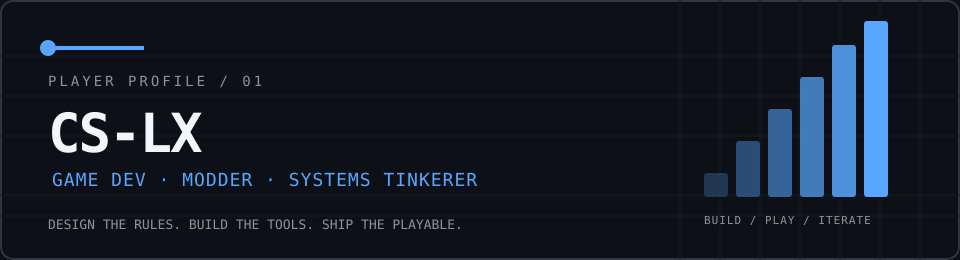
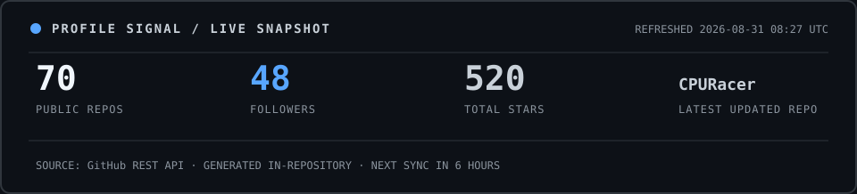
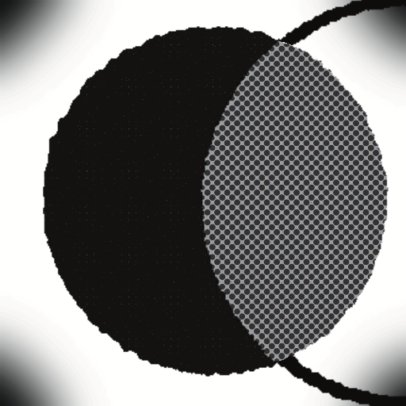
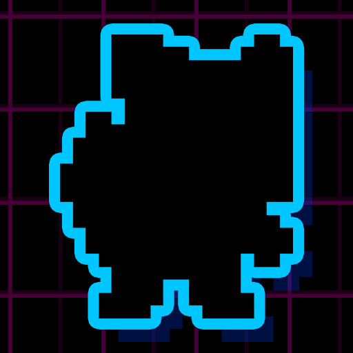
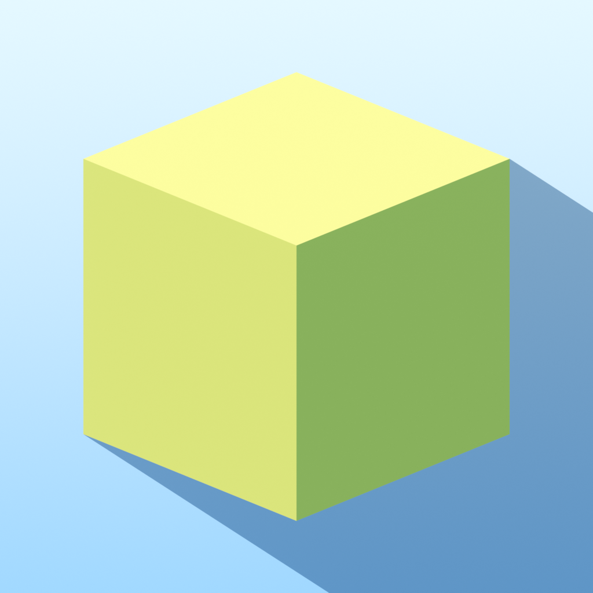

<div align="center">
  

  <p>
    <a href="https://github.com/CS-LX">GitHub</a> ·
    <a href="https://space.bilibili.com/312642275">Bilibili</a> ·
    <a href="https://steamcommunity.com/profiles/76561199222124610/">Steam</a> ·
    <a href="https://www.taptap.cn/user/570079718">TapTap</a> ·
    <a href="mailto:1659404657@qq.com">Email</a>
  </p>
</div>

## / ABOUT

> 把游戏机制拆开看，再把它们做成可玩的系统。

我叫钅离（LX），就读于天津科技大学，是一名独立游戏开发者与模组作者。
我关注玩法系统、工业模组、配方设计与工具开发；也会在 Unity、WinForms、Blender 和数字逻辑之间来回折腾。

```text
MAIN QUEST      C# / C++ / Lua · Unity gameplay engineering
SIDE QUEST      Survivalcraft modding · recipe & industrial systems
TOOLBELT        Git · Rider · Visual Studio · Blender · Figma
CURRENT MODE    Learning C++++, one mechanism at a time
```

## / PROFILE SIGNAL



<table>
  <tr>
    <td width="50%" valign="top">
      
    </td>
    <td width="50%" valign="top">
      <strong>LOCAL-FIRST PROFILE</strong><br/><br/>
      The visual system is generated and stored in this repository. It does not depend on public badge, stats, trophy, typing, or activity-graph services at render time.<br/><br/>
      <sub>Snapshot refresh: every 6 hours via GitHub Actions.</sub>
    </td>
  </tr>
</table>

## / SELECTED BUILDS

| Project | Focus |
| :-- | :-- |
| [PowerfulWindSlickedBackHair_Winform](https://github.com/CS-LX/PowerfulWindSlickedBackHair_Winform) | WinForms experiment |
| [Inhuman](https://github.com/CS-LX/Inhuman) | Independent game development |
| [RecipaediaEX](https://github.com/CS-LX/RecipaediaEX) | Recipe-system exploration |
| [SCEngine](https://github.com/CS-LX/SCEngine) | Survivalcraft ecosystem tooling |

## / SHIPPED GAMES

<table>
  <tr>
    <td width="64" valign="middle"></td>
    <td valign="middle"><strong>01 — StencilMask</strong><br/><sub>PROGRAMMER · Global Game Jam 2026, Beijing AF site · Best Art Award</sub></td>
    <td valign="middle" align="right"><a href="https://www.taptap.cn/app/814328">TapTap</a></td>
  </tr>
  <tr>
    <td width="64" valign="middle"></td>
    <td valign="middle"><strong>02 — 有病才能当牛马</strong><br/><sub>PRODUCER / PROGRAMMER / ARTIST · TapTap 21-Day Challenge 2025 · Participation Award</sub></td>
    <td valign="middle" align="right"><a href="https://www.taptap.cn/app/779871">TapTap</a> · <a href="https://store.steampowered.com/app/4143170">Steam</a></td>
  </tr>
  <tr>
    <td width="64" valign="middle"></td>
    <td valign="middle"><strong>03 — 本关考验你听声辩位功夫</strong><br/><sub>LEAD ARTIST / PROGRAMMER / DESIGNER · TapTap Spotlight 48h Jam 2025, Wuhan</sub></td>
    <td valign="middle" align="right"><a href="https://www.taptap.cn/app/789796">TapTap</a></td>
  </tr>
  <tr>
    <td width="64" valign="middle"></td>
    <td valign="middle"><strong>04 — 新建文件夹 / New Folder</strong><br/><sub>PROGRAMMER · TapTap Spotlight 48h Jam 2025, Chengdu</sub></td>
    <td valign="middle" align="right"><a href="https://www.taptap.cn/app/800774">TapTap</a></td>
  </tr>
  <tr>
    <td width="64" valign="middle"></td>
    <td valign="middle"><strong>05 — 影射 / Shadown</strong><br/><sub>PRODUCER · Independent project</sub></td>
    <td valign="middle" align="right"><a href="https://www.taptap.cn/app/793993">TapTap</a> · <a href="https://store.steampowered.com/app/4499100/">Steam</a></td>
  </tr>
</table>

## / CONTRIBUTION TRAIL

<p align="center">
  <picture>
    <source media="(prefers-color-scheme: dark)" srcset="https://raw.githubusercontent.com/CS-LX/CS-LX/output/github-contribution-grid-snake-dark.svg" />
    <source media="(prefers-color-scheme: light)" srcset="https://raw.githubusercontent.com/CS-LX/CS-LX/output/github-contribution-grid-snake.svg" />
    
  </picture>
</p>

<div align="center">
  <sub>STAY CURIOUS · BUILD SYSTEMS · SHIP PLAYABLE THINGS</sub>
</div>
