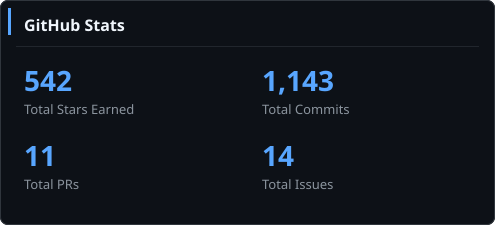
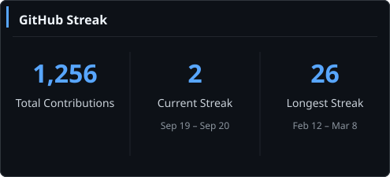
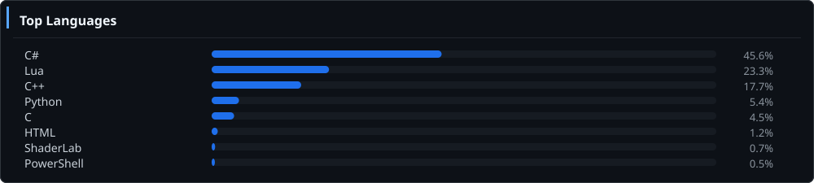
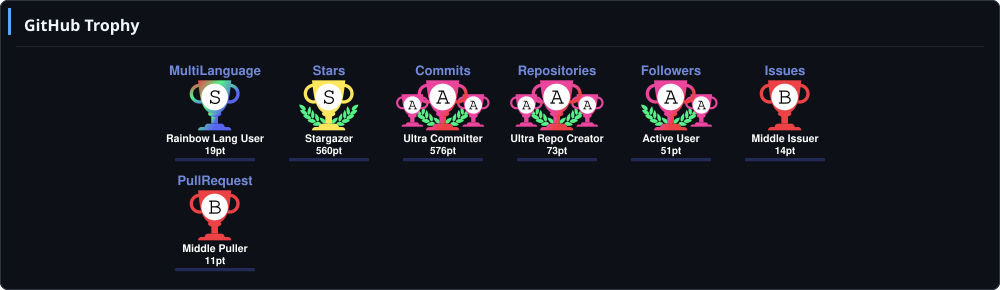
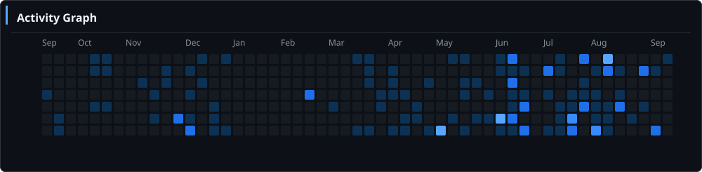
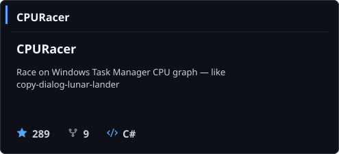
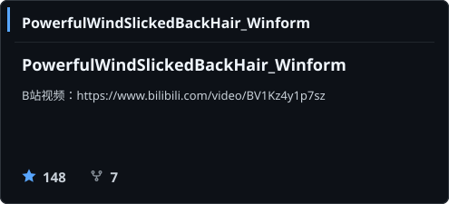
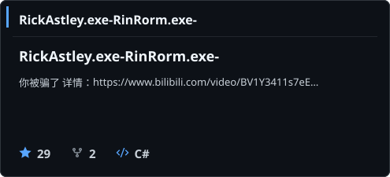
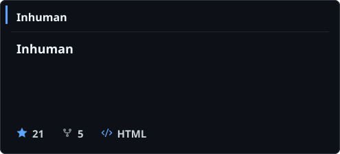

<div align="center">

<!-- 打字机动画标题 -->


<!-- 个人简介徽章 -->
[](https://github.com/CS-LX)
[](https://github.com/CS-LX)
[](https://github.com/CS-LX)
[](https://github.com/CS-LX?tab=repositories)

<br/>

<!-- 社交链接 -->
[](https://space.bilibili.com/312642275)
[](https://github.com/CS-LX)
[](mailto:1659404657@qq.com)
[](https://steamcommunity.com/profiles/76561199222124610/)
[](https://www.taptap.cn/user/570079718)

</div>

---

## 👋 关于我

```text
🎓 天津科技大学 · 独立游戏开发者 & 模组作者
💻 主攻 C# / C++ / Lua · Unity 游戏开发
🎮 Survivalcraft 生态 · 工业模组 · 配方系统
🛠️  也在折腾 WinForms / Blender / 数字逻辑
```

> *Learning C++++* — 持续探索系统底层与游戏机制的实现方式。

---

## 📊 GitHub 数据

<!-- 统计卡片：统一深色主题 -->
<table align="center" width="100%">
  <tr>
    <td valign="top" width="50%" align="center">
      
    </td>
    <td valign="top" width="50%" align="center">
      
    </td>
  </tr>
</table>

<p align="center">
  
</p>

<p align="center">
  
</p>

<!-- 贡献活动图 -->
<p align="center">
  
</p>

---

## ⭐ 精选项目

<!-- featured-projects:start -->
<table align="center" width="100%">
  <tr>
    <td width="50%" align="center">
      <a href="https://github.com/CS-LX/CPURacer">
        
      </a>
    </td>
    <td width="50%" align="center">
      <a href="https://github.com/CS-LX/PowerfulWindSlickedBackHair_Winform">
        
      </a>
    </td>
  </tr>
  <tr>
    <td width="50%" align="center">
      <a href="https://github.com/CS-LX/RickAstley.exe-RinRorm.exe-">
        
      </a>
    </td>
    <td width="50%" align="center">
      <a href="https://github.com/CS-LX/Inhuman">
        
      </a>
    </td>
  </tr>
</table>
<!-- featured-projects:end -->

---

## 🎮 已发布游戏

<table align="center" width="100%">
  <thead>
    <tr align="left">
      <th width="30%">游戏图标 & 名称 (Icon & Name)</th>
      <th width="20%">参与职位 (Roles)</th>
      <th width="35%">赛事与荣誉 (Events & Awards)</th>
      <th width="15%">链接 (Links)</th>
    </tr>
  </thead>
  <tbody>
    <tr>
      <td valign="middle">
        
        <strong> SUPERANCHOR</strong>
      </td>
      <td>程序<br><i>Programmer</i></td>
      <td>2026 中国 CiGA GameJam<br>广州万物破元站 <b>站点三等奖</b></td>
      <td>
        <a href="https://store.steampowered.com/app/4934990/SUPERANCHOR" target="_blank" style="background:#1b2838;color:#fff;padding:4px 8px;border-radius:4px;font-size:12px;text-decoration:none;">Steam</a>
      </td>
    </tr>
    <tr>
      <td valign="middle">
        
        <strong> StencilMask</strong>
      </td>
      <td>程序<br><i>Programmer</i></td>
      <td><strong>Global GameJam 2026</strong><br> 中国区 - 北京AF场 <b>最佳美术奖</b><br><i>[GGJ 2026] Best Art Award - Beijing AF Site</i></td>
      <td>
        <a href="https://www.taptap.cn/app/814328" target="_blank" style="background:#24DBB6;color:#000;padding:4px 8px;border-radius:4px;font-size:12px;text-decoration:none;">TapTap</a>
      </td>
    </tr>
    <tr>
      <td valign="middle">
        
        <strong> 有病才能当牛马</strong>
      </td>
      <td>制作人 / 程序 / 美术<br><i>Producer / Programmer / Artist</i></td>
      <td>2025 TapTap 聚光灯 21天挑战赛<br><b>全程参与奖</b><br><i>[TapTap 21-Day Challenge in 2025] - Participation Award</i></td>
      <td>
        <a href="https://www.taptap.cn/app/779871" target="_blank" style="background:#24DBB6;color:#000;padding:4px 8px;border-radius:4px;font-size:12px;text-decoration:none;">TapTap</a>
        <a href="https://store.steampowered.com/app/4143170" target="_blank" style="background:#1b2838;color:#fff;padding:4px 8px;border-radius:4px;font-size:12px;text-decoration:none;">Steam</a>
      </td>
    </tr>
    <tr>
      <td valign="middle">
        
        <strong> 本关考验你听声辩位功夫</strong>
      </td>
      <td>制作人 / 主美 / 策划 / 程序<br><i>Lead Artist / Programmer / Designer</i></td>
      <td>2025 TapTap 聚光灯 48h挑战赛<br> 武汉场 参赛作品<br><i>[TapTap Spotlight 48h Jam - Wuhan Site in 2025]</i></td>
      <td>
        <a href="https://www.taptap.cn/app/789796" target="_blank" style="background:#24DBB6;color:#000;padding:4px 8px;border-radius:4px;font-size:12px;text-decoration:none;">TapTap</a>
      </td>
    </tr>
    <tr>
      <td valign="middle">
        
        <strong> 新建文件夹 (New Folder)</strong>
      </td>
      <td>程序<br><i>Programmer</i></td>
      <td>2025 TapTap 聚光灯 48h挑战赛<br> 成都场 参赛作品<br><i>[TapTap Spotlight 48h Jam - Chengdu Site in 2025]</i></td>
      <td>
        <a href="https://www.taptap.cn/app/800774" target="_blank" style="background:#24DBB6;color:#000;padding:4px 8px;border-radius:4px;font-size:12px;text-decoration:none;">TapTap</a>
      </td>
    </tr>
    <tr>
      <td valign="middle">
        
        <strong> 影射-Shadown</strong>
      </td>
      <td>制作人<br><i>Producer</i></td>
      <td>独立开发项目<br><i>Solo Project</i></td>
      <td>
        <a href="https://www.taptap.cn/app/793993" target="_blank" style="background:#24DBB6;color:#000;padding:4px 8px;border-radius:4px;font-size:12px;text-decoration:none;">TapTap</a>
        <a href="https://store.steampowered.com/app/4499100/" target="_blank" style="background:#1b2838;color:#fff;padding:4px 8px;border-radius:4px;font-size:12px;text-decoration:none;">Steam</a>
      </td>
    </tr>
  </tbody>
</table>

---

## 🔧 技术栈

<div align="center">

**语言**


**工具 & 平台**


</div>

---

## 🐍 贡献贪吃蛇

<!-- 需要 Actions 工作流生成 snake 动画，见 .github/workflows/snake.yml -->
<div align="center">
  <picture>
    <source media="(prefers-color-scheme: dark)" srcset="https://raw.githubusercontent.com/CS-LX/CS-LX/output/github-contribution-grid-snake-dark.svg">
    <source media="(prefers-color-scheme: light)" srcset="https://raw.githubusercontent.com/CS-LX/CS-LX/output/github-contribution-grid-snake.svg">
    
  </picture>
</div>

---

<div align="center">

<sub>Built with ❤️ using</sub>
<br/>
<a href="https://github.com/anuraghazra/github-readme-stats">github-readme-stats</a> ·
<a href="https://github.com/DenverCoder1/github-readme-streak-stats">streak-stats</a> ·
<a href="https://github.com/Ashutosh00710/github-readme-activity-graph">activity-graph</a> ·
<a href="https://github.com/ryo-ma/github-profile-trophy">profile-trophy</a> ·
<a href="https://github.com/tandpfun/skill-icons">skill-icons</a>

<br/><br/>


</div>
